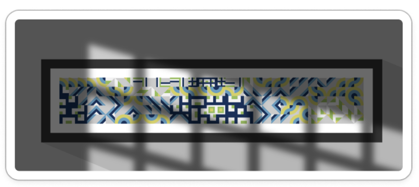

# 9103-TUT2-Group-D-wshi0890


- [9103-TUT2-Group-D-wshi0890](#9103-tut2-group-d-wshi0890)
  - [PART 1: How to Interact with the Work](#part-1-how-to-interact-with-the-work)
  - [PART 2: Details of my Individual Approach to Animating the Group Code](#part-2-details-of-my-individual-approach-to-animating-the-group-code)
    - [1. Method](#1-method)
    - [2. Animated Properties of the Image](#2-animated-properties-of-the-image)
      - [My Animation](#my-animation)
      - [Team Members' Animation](#team-members-animation)
    - [3. References to Inspiration](#3-references-to-inspiration)
    - [4. Technical Explanation](#4-technical-explanation)


## PART 1: How to Interact with the Work
After loading the page, the animation will start automatically, every 2 seconds the hour hand will move one frame, the PurpleLine will change four colors over time and the smallRectangle will update the position and color.

## PART 2: Details of my Individual Approach to Animating the Group Code
### 1. Method
Time-Based

### 2. Animated Properties of the Image
#### My Animation
1. **Clock**: I added the clock in the center of the image, where the hour hand travels through one frame every two seconds.
2. **Shadows**: The shadows will move slowly over time.
3. **PurpleLines**: The purple lines will smoothly change four colors over time.
#### Team Members' Animation
1. **TIAN's**: Click the PurplrLines will generate small circles move along the PurplrLines path.
2. **WANG's**: Change the size of the circles and the rotation of the large rectangles based on the FFT.
3. **ZENG's**: The circles transform into small Caterpillars floating in the image.
  
### 3. References to Inspiration
  During group work, we decided through [this video](https://openprocessing.org/sketch/2259882) to add shadow parts to the canvas. I really like the design and I think I can express the passage of time through this part. Expressing the invisible time through visualization.Because having a shadow means there is sunlight. So I animated this shadow in the personal part. Moving the shadow can show the change in the position of the sun, which expresses the passage of time.



  I also like Mondrian's paintings with borders like this, so I added the stroke to my personal section.


  My design concept is to use the overall image as a microcosm of a city. The clocks and shadows show the passage of time during the day. The changing colours of the PurpleLines represent the seasons of the year. The small rectangles that change position and colour every hour symbolize the movement of people in the city, reflecting the busyness and variety of urban life. These elements together show the rhythm and changes of urban life.
  


### 4. Technical Explanation
I used [millis()](https://p5js.org/reference/#/p5/millis) to obtain the runtime of the program, enabling the smooth movement of the clock's hour hand and the smooth transition of the PurplrLine colors. This is the example from p5.js:
```
function setup() {
  createCanvas(100, 100);

  describe('A white circle oscillates left and right on a gray background.');
}

function draw() {
  background(200);

  // Get the number of seconds the sketch has run.
  let s = millis() / 1000;

  // Calculate an x-coordinate.
  let x = 30 * sin(s) + 50;

  // Draw the circle.
  circle(x, 50, 30);
}
```